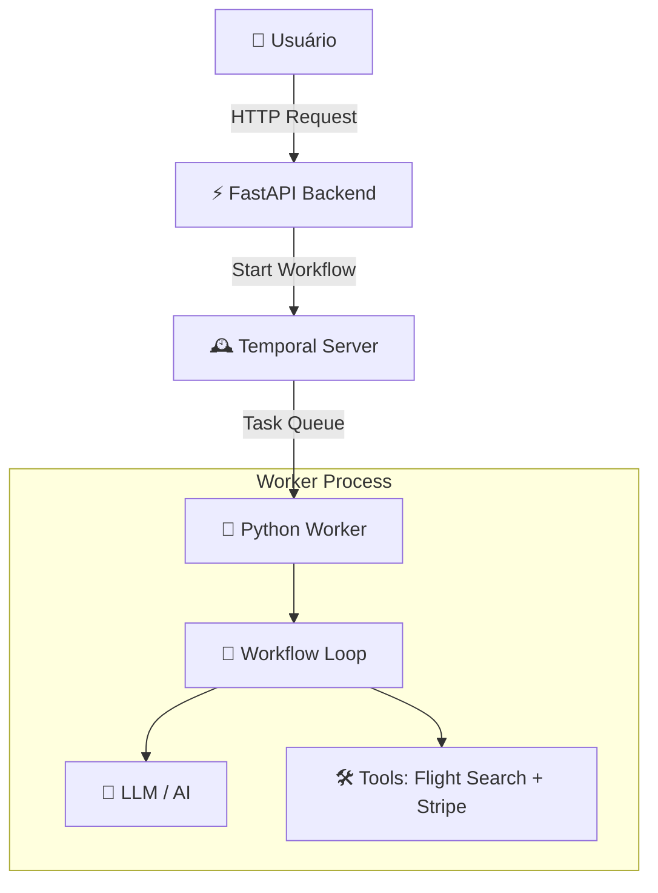

# 🧠 Temporal AI Agent (Python + uv + FastAPI)

[](https://temporal.io)
[](https://www.python.org/)
[](https://docs.astral.sh/uv/)
[](https://fastapi.tiangolo.com/)

Projeto de estudo sobre **Sistemas Agenciais Duráveis**.
Este repositório implementa um agente de viagens capaz de manter o estado da conversa e recuperar-se de falhas, utilizando **Temporal Workflows** para orquestração e **FastAPI** para a interface.

Baseado no tutorial oficial: [Durable AI Agent (Temporal Learn)](https://learn.temporal.io/tutorials/ai/durable-ai-agent/).

---

## 🧩 Arquitetura Simplificada

O fluxo não é apenas uma chamada de API. Existe um servidor de filas (Temporal) garantindo que o "cérebro" do agente não morra.



> **Nota:** Se o Worker cair, o Temporal Server mantém o histórico. Ao reiniciar, o Worker retoma o Workflow exatamente de onde parou.

---

## ✅ Pré-requisitos

- **OS:** Windows (foco em PowerShell)
- **Python:** Versão 3.10 (Necessário para compatibilidade com algumas libs do tutorial)
- **Gerenciador:** [uv](https://docs.astral.sh/uv/) instalado.
- **Temporal CLI:** Instalado e acessível no PATH.

> **Dica:** Para verificar suas versões de Python instaladas:
> ```powershell
> py -0p
> ```

---

## 🧼 Setup do Zero (Garantindo Python 3.10)

Este fluxo evita que o `uv` use a versão errada do Python (ex: 3.12+) por acidente.

### 1. Limpeza Inicial (Opcional)
*Execute apenas se quiser recriar o ambiente do zero.*

```powershell
Remove-Item -Recurse -Force .venv -ErrorAction SilentlyContinue
Remove-Item -Force uv.lock, pyproject.toml, .python-version -ErrorAction SilentlyContinue
```

### 2. Inicialização e Pinagem
Inicializa o projeto e força o uso do Python 3.10 no ambiente virtual.

```powershell
# Inicia o projeto com Python 3.10
uv init -p 3.10 .

# Cria o arquivo .python-version travado no 3.10
uv python pin 3.10
```

### 3. Configuração do `pyproject.toml`
Abra o arquivo `pyproject.toml` e garanta que a restrição de versão está correta:

```toml
[project]
name = "temporal-ai-agent"
version = "0.1.0"
requires-python = ">=3.10,<3.11"
dependencies = []
```

### 4. Instalação das Dependências
Sincroniza o ambiente e instala as libs necessárias.

```powershell
uv sync
uv add python-dotenv fastapi jinja2 litellm stripe temporalio uvicorn requests
```

### 5. Validação
Confirme se o ambiente está rodando a versão correta:

```powershell
uv run python -V
# Deve retornar: Python 3.10.x
```

---

## 🔐 Variáveis de Ambiente

Crie um arquivo `.env` na raiz do projeto:

```env
# Temporal (Local)
TEMPORAL_ADDRESS=localhost:7233

# LLM Provider (Ex: OpenAI ou Anthropic)
OPENAI_API_KEY=sk-proj-xxxxxxxxxxxxxxxxxxx

# Ferramentas (Ex: Stripe Sandbox)
STRIPE_API_KEY=sk_test_xxxxxxxxxxxxxxxxxxx
```

---

## 🏃 Como Rodar

Você precisará de 3 terminais (PowerShell) abertos:

### Terminal 1: Temporal Server
Inicia o servidor de desenvolvimento do Temporal.
```powershell
temporal server start-dev
```
*Acesse a UI em: http://localhost:8233*

### Terminal 2: Worker (O Agente)
O processo que escuta as filas e executa o código do agente.
```powershell
uv run python run_worker.py
```

### Terminal 3: FastAPI (Interface)
O backend que recebe as requisições do usuário.
```powershell
uv run uvicorn app.main:app --reload
```

---

## 🛠️ Troubleshooting (Windows/PowerShell)

### 1. Erro de Permissão de Script
Se ao tentar ativar o venv aparecer erro de script não assinado:
```powershell
Set-ExecutionPolicy -ExecutionPolicy RemoteSigned -Scope CurrentUser
```

### 2. `uv` não reconhecido
Se instalou o `uv` mas o terminal não acha, adicione ao PATH ou use o caminho completo. Geralmente fica em:
```powershell
$env:USERPROFILE\.cargo\bin\uv.exe
# ou
$env:LOCALAPPDATA\uv\uv.exe
```

### 3. Conflito de Portas
Se o Temporal não subir, verifique se a porta 7233 ou 8233 já está em uso.
```powershell
netstat -ano | findstr :7233
```

---

## 📚 Referências

* **Tutorial Base:** [Temporal Durable AI Agent](https://learn.temporal.io/tutorials/ai/durable-ai-agent/)
* **Documentação uv:** [Astral.sh/uv](https://docs.astral.sh/uv/)
* **Conceito de Agentes:** [DeepLearning.AI - AI Agentic Workflows](https://www.deeplearning.ai/)
